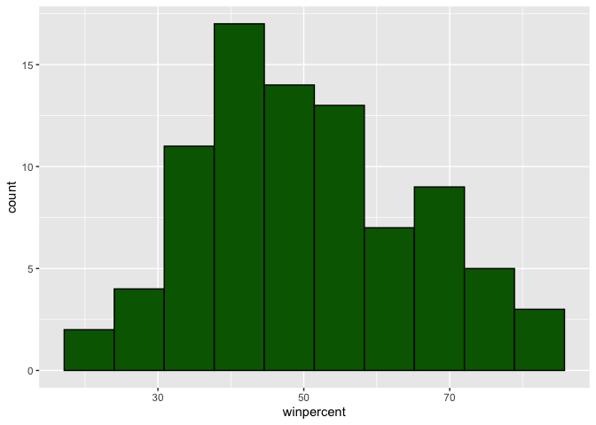
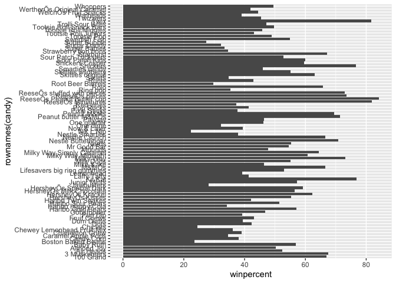
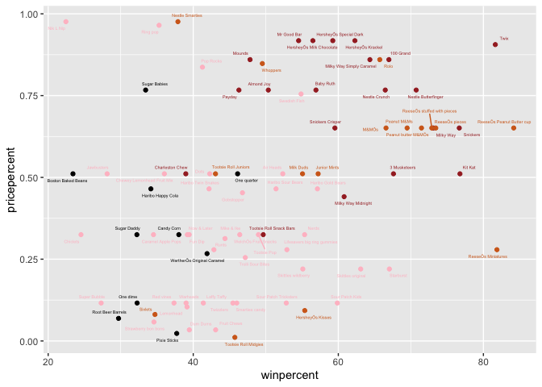
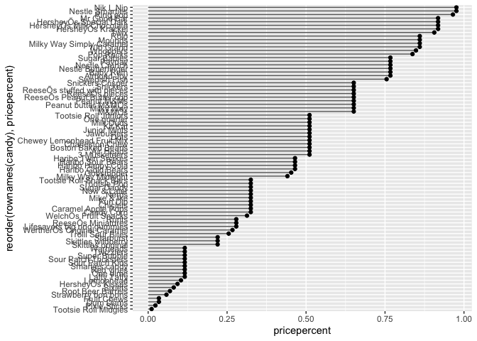
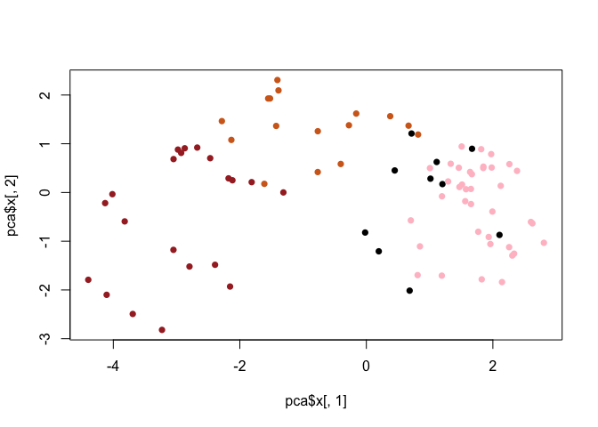
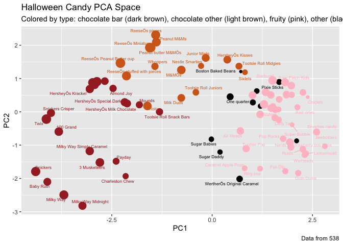

Halloween Candy
================
Julia Ainsworth

## Quarto

In this mini-project we will examine 538 Halloween Candy data. What is
your favorite candy? What is nougat anyway??

Importing the candy dataset

``` r
candy <- read.csv("candy-data.csv", row.names = 1)
head(candy)
```

                 chocolate fruity caramel peanutyalmondy nougat crispedricewafer
    100 Grand            1      0       1              0      0                1
    3 Musketeers         1      0       0              0      1                0
    One dime             0      0       0              0      0                0
    One quarter          0      0       0              0      0                0
    Air Heads            0      1       0              0      0                0
    Almond Joy           1      0       0              1      0                0
                 hard bar pluribus sugarpercent pricepercent winpercent
    100 Grand       0   1        0        0.732        0.860   66.97173
    3 Musketeers    0   1        0        0.604        0.511   67.60294
    One dime        0   0        0        0.011        0.116   32.26109
    One quarter     0   0        0        0.011        0.511   46.11650
    Air Heads       0   0        0        0.906        0.511   52.34146
    Almond Joy      0   1        0        0.465        0.767   50.34755

# Q1. How many different candy types are in this dataset?

``` r
nrow(candy)
```

    [1] 85

# Q2. How many fruity candy types are in the dataset?

``` r
num_fruity_candies <- sum(candy$fruity)
num_fruity_candies
```

    [1] 38

Finding out how popular the candy is:

``` r
candy["Twix", ]$winpercent
```

    [1] 81.64291

# Q3. What is your favorite candy in the dataset and what is it’s winpercent value?

A: Reese’s pieces

``` r
candy["ReeseÕs pieces", ]$winpercent
```

    [1] 73.43499

# Q4. What is the winpercent value for “Kit Kat”?

``` r
candy["Kit Kat", ]$winpercent
```

    [1] 76.7686

# Q5. What is the winpercent value for “Tootsie Roll Snack Bars”?

``` r
candy["Tootsie Roll Snack Bars", ]$winpercent
```

    [1] 49.6535

Installed the skimr package:

``` r
#can use skimr::skim()

skimr::skim(candy)
```

|                                                  |       |
|:-------------------------------------------------|:------|
| Name                                             | candy |
| Number of rows                                   | 85    |
| Number of columns                                | 12    |
| \_\_\_\_\_\_\_\_\_\_\_\_\_\_\_\_\_\_\_\_\_\_\_   |       |
| Column type frequency:                           |       |
| numeric                                          | 12    |
| \_\_\_\_\_\_\_\_\_\_\_\_\_\_\_\_\_\_\_\_\_\_\_\_ |       |
| Group variables                                  | None  |

Data summary

**Variable type: numeric**

| skim_variable    | n_missing | complete_rate |  mean |    sd |    p0 |   p25 |   p50 |   p75 |  p100 | hist  |
|:-----------------|----------:|--------------:|------:|------:|------:|------:|------:|------:|------:|:------|
| chocolate        |         0 |             1 |  0.44 |  0.50 |  0.00 |  0.00 |  0.00 |  1.00 |  1.00 | ▇▁▁▁▆ |
| fruity           |         0 |             1 |  0.45 |  0.50 |  0.00 |  0.00 |  0.00 |  1.00 |  1.00 | ▇▁▁▁▆ |
| caramel          |         0 |             1 |  0.16 |  0.37 |  0.00 |  0.00 |  0.00 |  0.00 |  1.00 | ▇▁▁▁▂ |
| peanutyalmondy   |         0 |             1 |  0.16 |  0.37 |  0.00 |  0.00 |  0.00 |  0.00 |  1.00 | ▇▁▁▁▂ |
| nougat           |         0 |             1 |  0.08 |  0.28 |  0.00 |  0.00 |  0.00 |  0.00 |  1.00 | ▇▁▁▁▁ |
| crispedricewafer |         0 |             1 |  0.08 |  0.28 |  0.00 |  0.00 |  0.00 |  0.00 |  1.00 | ▇▁▁▁▁ |
| hard             |         0 |             1 |  0.18 |  0.38 |  0.00 |  0.00 |  0.00 |  0.00 |  1.00 | ▇▁▁▁▂ |
| bar              |         0 |             1 |  0.25 |  0.43 |  0.00 |  0.00 |  0.00 |  0.00 |  1.00 | ▇▁▁▁▂ |
| pluribus         |         0 |             1 |  0.52 |  0.50 |  0.00 |  0.00 |  1.00 |  1.00 |  1.00 | ▇▁▁▁▇ |
| sugarpercent     |         0 |             1 |  0.48 |  0.28 |  0.01 |  0.22 |  0.47 |  0.73 |  0.99 | ▇▇▇▇▆ |
| pricepercent     |         0 |             1 |  0.47 |  0.29 |  0.01 |  0.26 |  0.47 |  0.65 |  0.98 | ▇▇▇▇▆ |
| winpercent       |         0 |             1 | 50.32 | 14.71 | 22.45 | 39.14 | 47.83 | 59.86 | 84.18 | ▃▇▆▅▂ |

# Q6. Is there any variable/column that looks to be on a different scale to the majority of the other columns in the dataset?

A: winpercent is on a different scale than the rest of the columns in
the dataset

# Q7. What do you think a zero and one represent for the candy\$chocolate column?

Probably true or false for whether the candy contains chocolate or not

# Q8. Plot a histogram of winpercent values

``` r
hist(candy$winpercent)
```


Alternately, using ggplot

``` r
library(ggplot2)
ggplot(candy) + 
  aes(winpercent) + 
  geom_histogram(bins =10, col="black", fill="darkgreen")
```



# Q9. Is the distribution of winpercent values symmetrical?

No

# Q10. Is the center of the distribution above or below 50%?

Below

# Q11. On average is chocolate candy higher or lower ranked than fruit candy?

Higher!

``` r
choc.inds <- as.logical(candy$chocolate)
chocolate.win <- candy[choc.inds, ]$winpercent
mean(chocolate.win)
```

    [1] 60.92153

``` r
fruit.inds <- as.logical(candy$fruity)
fruit.win <- candy[fruit.inds, ]$winpercent
mean(fruit.win)
```

    [1] 44.11974

# Q12. Is this difference statistically significant?

``` r
t.test(chocolate.win, fruit.win)
```


        Welch Two Sample t-test

    data:  chocolate.win and fruit.win
    t = 6.2582, df = 68.882, p-value = 2.871e-08
    alternative hypothesis: true difference in means is not equal to 0
    95 percent confidence interval:
     11.44563 22.15795
    sample estimates:
    mean of x mean of y 
     60.92153  44.11974 

A: looks like yes!

# 3. Overall Candy Rankings

The base R `sort()` and `order()` functions are very useful!

``` r
x <- c(5, 2, 1, 6)
sort(x)
```

    [1] 1 2 5 6

``` r
# versus

x[order(x)]
```

    [1] 1 2 5 6

We can arrange this dataset using dplyr This one arranges them in
ascending order so we can see the lowest 5

# Q13. What are the five least liked candy types in this set?

``` r
library(dplyr)
```


    Attaching package: 'dplyr'

    The following objects are masked from 'package:stats':

        filter, lag

    The following objects are masked from 'package:base':

        intersect, setdiff, setequal, union

``` r
candy %>% 
  arrange(winpercent) %>% 
  head(5)
```

                       chocolate fruity caramel peanutyalmondy nougat
    Nik L Nip                  0      1       0              0      0
    Boston Baked Beans         0      0       0              1      0
    Chiclets                   0      1       0              0      0
    Super Bubble               0      1       0              0      0
    Jawbusters                 0      1       0              0      0
                       crispedricewafer hard bar pluribus sugarpercent pricepercent
    Nik L Nip                         0    0   0        1        0.197        0.976
    Boston Baked Beans                0    0   0        1        0.313        0.511
    Chiclets                          0    0   0        1        0.046        0.325
    Super Bubble                      0    0   0        0        0.162        0.116
    Jawbusters                        0    1   0        1        0.093        0.511
                       winpercent
    Nik L Nip            22.44534
    Boston Baked Beans   23.41782
    Chiclets             24.52499
    Super Bubble         27.30386
    Jawbusters           28.12744

# Q14. What are the top 5 all time favorite candy types out of this set?

``` r
candy %>%
  arrange(desc(winpercent)) %>%
  head(n=5)
```

                              chocolate fruity caramel peanutyalmondy nougat
    ReeseÕs Peanut Butter cup         1      0       0              1      0
    ReeseÕs Miniatures                1      0       0              1      0
    Twix                              1      0       1              0      0
    Kit Kat                           1      0       0              0      0
    Snickers                          1      0       1              1      1
                              crispedricewafer hard bar pluribus sugarpercent
    ReeseÕs Peanut Butter cup                0    0   0        0        0.720
    ReeseÕs Miniatures                       0    0   0        0        0.034
    Twix                                     1    0   1        0        0.546
    Kit Kat                                  1    0   1        0        0.313
    Snickers                                 0    0   1        0        0.546
                              pricepercent winpercent
    ReeseÕs Peanut Butter cup        0.651   84.18029
    ReeseÕs Miniatures               0.279   81.86626
    Twix                             0.906   81.64291
    Kit Kat                          0.511   76.76860
    Snickers                         0.651   76.67378

# Q15. Make a first barplot of candy ranking based on winpercent values.

Using ggplot: (note: use geom_col over geom_bar most of the time!!)

``` r
library(ggplot2)

ggplot(candy) + 
  aes(winpercent, rownames(candy)) +
  geom_col()
```



# Q16. This is quite ugly, use the reorder() function to get the bars sorted by winpercent?

``` r
p <- ggplot(candy) +
aes(winpercent, reorder(rownames(candy),winpercent)) +
  geom_col()
p
```


If I wanted to save this, I would use:

``` r
#If I want to save this barplot
# ggsave("mybarplot.png")
```

To use colors for the plot, we need to set up a vector with colors

``` r
my_cols = rep("black", nrow(candy))
my_cols[as.logical(candy$chocolate)] = "chocolate"
my_cols[as.logical(candy$bar)] = "brown"
my_cols[as.logical(candy$fruity)] = "pink"
```

``` r
ggplot(candy) + 
  aes(winpercent, reorder(rownames(candy), winpercent)) +
  geom_col(fill = my_cols)
```


# Q17. What is the worst ranked chocolate candy?

A: Nik E Nip

# - Q18. What is the best ranked fruity candy?

A: Starburst

Now we can use ggrepel to make the text labels easier to read

``` r
library(ggrepel)

#A plot of price vs the percentage of winning

ggplot(candy) + 
  aes(winpercent, pricepercent, label =rownames(candy)) +
  geom_point(col=my_cols) +
  geom_text_repel(col=my_cols, size = 1.4, max.overlaps = 11)
```



``` r
# this combination of arguments for text_repel gets us a plot with everything labeled
```

# Q19. Which candy type is the highest ranked in terms of winpercent for the least money - i.e. offers the most bang for your buck?

Reese’s miniatures

# Q20. What are the top 5 most expensive candy types in the dataset and of these which is the least popular?

``` r
ord <- order(candy$pricepercent, decreasing = T)
head( candy[ord, c(11,12)], n =5)
```

                             pricepercent winpercent
    Nik L Nip                       0.976   22.44534
    Nestle Smarties                 0.976   37.88719
    Ring pop                        0.965   35.29076
    HersheyÕs Krackel               0.918   62.28448
    HersheyÕs Milk Chocolate        0.918   56.49050

The least popular among the most expensive candy types is Nik L Nip

# Q21. Make a barplot again with geom_col() this time using pricepercent and then improve this step by step, first ordering the x-axis by value and finally making a so called “dot chat” or “lollipop” chart by swapping geom_col() for geom_point() + geom_segment().

``` r
ggplot(candy) + 
  aes(pricepercent, reorder(rownames(candy), pricepercent)) +
  geom_segment(aes(yend  =reorder(rownames(candy), pricepercent),
                   xend=0), col="gray40") +
  geom_point()
```



``` r
library(corrplot)
```

    corrplot 0.92 loaded

``` r
cij <- cor(candy)
corrplot(cij)
```


# Q22. Examining this plot what two variables are anti-correlated (i.e. have minus values)?

Chocolate and fruit!

# Q23. Similarly, what two variables are most positively correlated?

Winpercent and chocolate seem to be associated

Now we can use PCA to the candy dataset, remembering that we need to
scale the data because winpercent is at a different scale than the rest
of the data (0 to 100 instead of 0 to 1)

``` r
pca <- prcomp(candy, scale = T)
summary(pca)
```

    Importance of components:
                              PC1    PC2    PC3     PC4    PC5     PC6     PC7
    Standard deviation     2.0788 1.1378 1.1092 1.07533 0.9518 0.81923 0.81530
    Proportion of Variance 0.3601 0.1079 0.1025 0.09636 0.0755 0.05593 0.05539
    Cumulative Proportion  0.3601 0.4680 0.5705 0.66688 0.7424 0.79830 0.85369
                               PC8     PC9    PC10    PC11    PC12
    Standard deviation     0.74530 0.67824 0.62349 0.43974 0.39760
    Proportion of Variance 0.04629 0.03833 0.03239 0.01611 0.01317
    Cumulative Proportion  0.89998 0.93832 0.97071 0.98683 1.00000

Now we can plot PC1 vs PC2

``` r
plot(pca$x[,1], pca$x[,2], col=my_cols, pch = 16)
```



Now we can make a new dataframe with our PCA results and candy data to
be able to plot this with ggplot

``` r
my_data <- cbind(candy, pca$x[,1:3])
```

``` r
p <- ggplot(my_data) +
  aes(x = PC1, y = PC2,
      size = winpercent/100,
      text=rownames(my_data),
      label = rownames(my_data)) +
  geom_point(col=my_cols)
p
```


Then we will add non-overlapping candy names, title, and a subtitle

``` r
library(ggrepel)

p + geom_text_repel(size = 2.2, col = my_cols, max.overlaps = 7) +
  theme(legend.position = "none") +
  labs(title = "Halloween Candy PCA Space",
       subtitle = "Colored by type: chocolate bar (dark brown), chocolate other (light brown), fruity (pink), other (black)", 
       caption = "Data from 538")
```

    Warning: ggrepel: 25 unlabeled data points (too many overlaps). Consider
    increasing max.overlaps



Also trying plotly to be able to mouse over the plot: Note: this worked,
but the pdf did not like it!! I have commented it out

``` r
# library(plotly)
# ggplotly(p)
```

``` r
par(mar=c(8,4,2,2))
barplot(pca$rotation[,1], las=2, ylab="PC1 Contribution")
```


# Q24. What original variables are picked up strongly by PC1 in the positive direction? Do these make sense to you?

Yes! It is showing us what we’ve seen throughout the dataset, where
fruity and pluribus are very different from chocolate and bar
